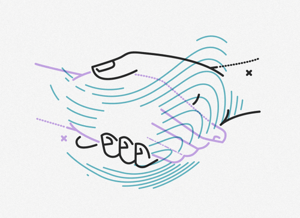

# Automated Mentor-Mentee Matching Algorithm

## Client
HUMBER POLYTECHNIC ADMIN DEPARTMENT

## OverView
As part of a career mentorship program, I developed an automated solution to simplify and improve the mentor-mentee matching process. This project focused on ensuring alignment between mentees’ aspirations and mentors’ expertise while addressing inefficiencies in traditional matching methods.
  
The project involved:
- Ranking factors like professional background, career goals, and academic aspirations.
- Integrating Humber Learning Outcomes like Leadership and Collaboration.

## My Contributions
**Text Minining for Open-Ended Responses:**
I analyzed mentees’ and mentors’ open-ended survey responses, such as:

Mentees: "Where do you aspire to work after graduation?"

Mentors: "Describe your professional background."

Using techniques like tokenization and keyword extraction, I derived key insights from the text data to align mentees’ career goals with mentors’ areas of expertise.
---
**Custom Matching Algorithm**

**Structured Criteria:** Prioritized career development goals, academic program alignment, and Humber Learning Outcomes (HLOs).

**Unstructured Data:** Incorporated text analysis to ensure personalized and relevant matches.
---
**ADMIN GRAPHICAL USER INTERFACE DEVELOPEMENT**

I created a user-friendly GUI for program administrators to:Visualize mentor-mentee matches, including match scores and criteria used.

Generate automated reports to streamline program management.
----
**AGILE PROJECT MANAGEMENT**
To ensure the project stayed on track, we followed agile practices, breaking the work into four key sprints:

Data exploration, preprocessing, and SWOT analysis.

Algorithm design and integration of text analysis.

Dashboard creation and functionality testing.

Final testing, report generation, and deployment.

## Deliverables 
**Matching Algorithm:** A scalable algorithm that incorporates structured and unstructured data for accurate pairing.

**Admin Dashboard:** A comprehensive GUI to review, validate, and manage mentorship matches.

**SWOT Analysis Report:** A detailed evaluation of existing matching tools with actionable insights.

**Recommendation Report:** Suggestions to enhance mentorship program operations.

**Final Matching Report:** A clear and concise summary of mentor-mentee pairings.

**A Wireframe:** Mentioning details steps regarding hoe to use the solution.

## OUTCOME

**Better Matches:** By combining text mining and structured criteria, the system delivered highly relevant mentor-mentee pairings.

**Efficiency:** Automated workflows reduced **manual effort by 80%**, freeing up time for strategic improvements.

## Skills & Tools Used
**Programming & Analysis:** Python (Pandas, NLTK,Numpy, TF-IDF ) for text and data processing.

**Algorithm Design:** Developed a ranking-based system for matching.

**Visualization:** Designed an interactive dashboard for easy use by administrators.

**Agile Practices:** Organized project milestones using sprints to manage deadlines effectively. 

[Back to Portfolio](README.md)
